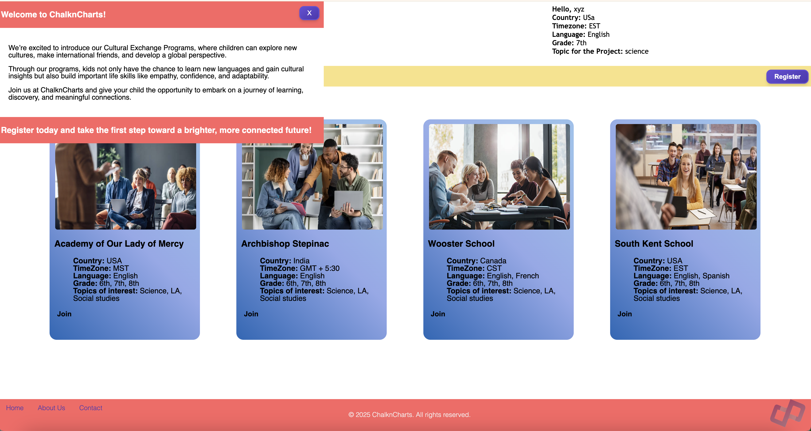
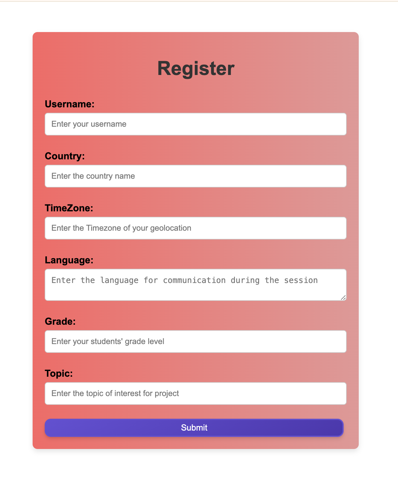
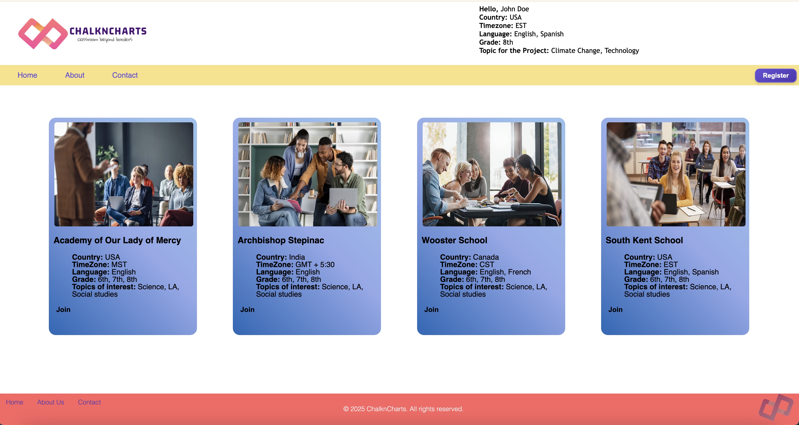

# ChalknCharts

## Description

ChalknCharts was created to allow schools and easy way to connect with other schools world wide for cultural exchange, language learning, and friendship.

## Usage 

To use ChalknCharts start with clicking the register button to sign up. Once submited the data can viewed at the top right of the page. Then you can scroll through and select a school that you would like to schedule an event with. There will be a confirmation of sucess at the bottom of the school card when you have joined.

## Mock-Up

The following animation demonstrates the application functionality:

## License

Please refer to  the LICNESE in the repo.

